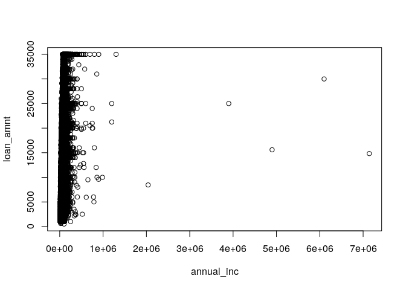

# Integrating H2O & tidyverse

During [LatinR2019](https://latin-r.com/), several people were asking
Erin Ledell about tidyverse and H2O integration, she said that it was
actually a work in mind. So I thought, if my community would enjoy it,
maybe as a community we should do it -that’s what open source is about-.

By installing the `tidyh2o` package:

``` r
if (!require("remotes")) {
  install.packages("remotes")
}
remotes::install_github("jcrodriguez1989/tidyh2o")
```

we can use `h2o` in a tidyverse style:

``` r
library("dplyr")
```

    ## 
    ## Attaching package: 'dplyr'

    ## The following objects are masked from 'package:stats':
    ## 
    ##     filter, lag

    ## The following objects are masked from 'package:base':
    ## 
    ##     intersect, setdiff, setequal, union

``` r
library("h2o")
```

    ## 
    ## ----------------------------------------------------------------------
    ## 
    ## Your next step is to start H2O:
    ##     > h2o.init()
    ## 
    ## For H2O package documentation, ask for help:
    ##     > ??h2o
    ## 
    ## After starting H2O, you can use the Web UI at http://localhost:54321
    ## For more information visit http://docs.h2o.ai
    ## 
    ## ----------------------------------------------------------------------

    ## 
    ## Attaching package: 'h2o'

    ## The following objects are masked from 'package:stats':
    ## 
    ##     cor, sd, var

    ## The following objects are masked from 'package:base':
    ## 
    ##     &&, %*%, %in%, ||, apply, as.factor, as.numeric, colnames,
    ##     colnames<-, ifelse, is.character, is.factor, is.numeric, log,
    ##     log10, log1p, log2, round, signif, trunc

``` r
library("tidyh2o")
```

    ## 
    ## Attaching package: 'tidyh2o'

    ## The following object is masked from 'package:dplyr':
    ## 
    ##     %>%

``` r
h2o.init()
```

    ## 
    ## H2O is not running yet, starting it now...
    ## 
    ## Note:  In case of errors look at the following log files:
    ##     /tmp/Rtmpny62eD/h2o_jcrodriguez_started_from_r.out
    ##     /tmp/Rtmpny62eD/h2o_jcrodriguez_started_from_r.err
    ## 
    ## 
    ## Starting H2O JVM and connecting: . Connection successful!
    ## 
    ## R is connected to the H2O cluster: 
    ##     H2O cluster uptime:         1 seconds 533 milliseconds 
    ##     H2O cluster timezone:       America/Argentina/Cordoba 
    ##     H2O data parsing timezone:  UTC 
    ##     H2O cluster version:        3.26.0.99999 
    ##     H2O cluster version age:    3 days  
    ##     H2O cluster name:           H2O_started_from_R_jcrodriguez_qoz384 
    ##     H2O cluster total nodes:    1 
    ##     H2O cluster total memory:   3.88 GB 
    ##     H2O cluster total cores:    8 
    ##     H2O cluster allowed cores:  8 
    ##     H2O cluster healthy:        TRUE 
    ##     H2O Connection ip:          localhost 
    ##     H2O Connection port:        54321 
    ##     H2O Connection proxy:       NA 
    ##     H2O Internal Security:      FALSE 
    ##     H2O API Extensions:         Amazon S3, XGBoost, Algos, AutoML, Core V3, TargetEncoder, Core V4 
    ##     R Version:                  R version 3.6.1 (2019-07-05)

``` r
h2o.no_progress() # Turn off progress bars for notebook readability

# Use data file from GitHub
data_file <- 
  "https://raw.githubusercontent.com/ledell/LatinR-2019-h2o-tutorial/master/data/loan.csv"

data <- h2o.importFile(data_file) # 163,987 rows x 15 columns
data %>% dim()
```

    ## [1] 163987     15

``` r
# Optional (to speed up the examples)
data %<>% sample_n(30000)

data %<>%
  mutate(bad_loan = as.factor(bad_loan)) #encode the binary repsonse as a factor
data$bad_loan %>% h2o.levels() #optional: this shows the factor levels
```

    ## [1] "0" "1"

``` r
data %>% h2o.describe()
```

    ##                    Label Type Missing Zeros PosInf NegInf     Min
    ## 1              loan_amnt  int       0     0      0      0  500.00
    ## 2                   term enum       0 23704      0      0    0.00
    ## 3               int_rate real       0     0      0      0    5.42
    ## 4             emp_length  int    1074  2498      0      0    0.00
    ## 5         home_ownership enum       0 14714      0      0    0.00
    ## 6             annual_inc real       1     0      0      0 4800.00
    ## 7                purpose enum       0   514      0      0    0.00
    ## 8             addr_state enum       0    83      0      0    0.00
    ## 9                    dti real       0    49      0      0    0.00
    ## 10           delinq_2yrs  int       5 25505      0      0    0.00
    ## 11            revol_util real      38   273      0      0    0.00
    ## 12             total_acc  int       5     0      0      0    1.00
    ## 13              bad_loan enum       0 24510      0      0    0.00
    ## 14 longest_credit_length  int       5     1      0      0    0.00
    ## 15   verification_status enum       0 10701      0      0    0.00
    ##           Max         Mean        Sigma Cardinality
    ## 1    35000.00 1.312764e+04 7.939800e+03          NA
    ## 2        1.00 2.098667e-01 4.072201e-01           2
    ## 3       26.06 1.372839e+01 4.405643e+00          NA
    ## 4       10.00 5.695049e+00 3.594248e+00          NA
    ## 5        4.00           NA           NA           5
    ## 6  7141778.00 7.258091e+04 8.094033e+04          NA
    ## 7       13.00           NA           NA          14
    ## 8       48.00           NA           NA          49
    ## 9       39.88 1.588233e+01 7.580536e+00          NA
    ## 10      18.00 2.291049e-01 7.070264e-01          NA
    ## 11     150.70 5.405765e+01 2.519683e+01          NA
    ## 12      93.00 2.470102e+01 1.167864e+01          NA
    ## 13       1.00 1.830000e-01 3.866730e-01           2
    ## 14      58.00 1.484171e+01 6.915021e+00          NA
    ## 15       1.00 6.433000e-01 4.790332e-01           2

``` r
splits <- data %>% h2o.splitFrame(
  ratios = c(0.7, 0.15), # partition data into 70%, 15%, 15% chunks
  destination_frames = c("train", "valid", "test"), # frame ID (not required)
  seed = 1) # setting a seed will guarantee reproducibility
train <- splits[[1]]
valid <- splits[[2]]
test <- splits[[3]]

train %>% nrow
```

    ## [1] 21101

``` r
valid %>% nrow
```

    ## [1] 4407

``` r
test %>% nrow
```

    ## [1] 4492

``` r
y <- "bad_loan"
#remove the interest rate column because it's correlated with the outcome
x <- setdiff(names(data), c(y, "int_rate"))
print(x)
```

    ##  [1] "loan_amnt"             "term"                 
    ##  [3] "emp_length"            "home_ownership"       
    ##  [5] "annual_inc"            "purpose"              
    ##  [7] "addr_state"            "dti"                  
    ##  [9] "delinq_2yrs"           "revol_util"           
    ## [11] "total_acc"             "longest_credit_length"
    ## [13] "verification_status"

``` r
aml <- h2o.automl(y = y, x = x,
                  training_frame = train,
                  max_models = 10,
                  seed = 1)
(lb <- aml@leaderboard)
```

    ##                                              model_id       auc   logloss
    ## 1    StackedEnsemble_AllModels_AutoML_20191011_044824 0.6783498 0.4507342
    ## 2 StackedEnsemble_BestOfFamily_AutoML_20191011_044824 0.6774796 0.4510474
    ## 3                    XGBoost_3_AutoML_20191011_044824 0.6750165 0.4502219
    ## 4                    XGBoost_1_AutoML_20191011_044824 0.6710723 0.4517392
    ## 5                        GLM_1_AutoML_20191011_044824 0.6706989 0.4520647
    ## 6                    XGBoost_2_AutoML_20191011_044824 0.6670395 0.4532936
    ##   mean_per_class_error      rmse       mse
    ## 1            0.3727287 0.3770309 0.1421523
    ## 2            0.3713866 0.3771510 0.1422429
    ## 3            0.3754482 0.3768767 0.1420360
    ## 4            0.3749570 0.3777027 0.1426593
    ## 5            0.3754389 0.3772410 0.1423108
    ## 6            0.3788904 0.3782816 0.1430969
    ## 
    ## [12 rows x 6 columns]

``` r
print(lb, n = nrow(lb))
```

    ##                                               model_id       auc   logloss
    ## 1     StackedEnsemble_AllModels_AutoML_20191011_044824 0.6783498 0.4507342
    ## 2  StackedEnsemble_BestOfFamily_AutoML_20191011_044824 0.6774796 0.4510474
    ## 3                     XGBoost_3_AutoML_20191011_044824 0.6750165 0.4502219
    ## 4                     XGBoost_1_AutoML_20191011_044824 0.6710723 0.4517392
    ## 5                         GLM_1_AutoML_20191011_044824 0.6706989 0.4520647
    ## 6                     XGBoost_2_AutoML_20191011_044824 0.6670395 0.4532936
    ## 7                         GBM_1_AutoML_20191011_044824 0.6618238 0.4549365
    ## 8                         GBM_2_AutoML_20191011_044824 0.6609024 0.4562146
    ## 9                         GBM_5_AutoML_20191011_044824 0.6587350 0.4563483
    ## 10                        GBM_3_AutoML_20191011_044824 0.6532785 0.4595965
    ## 11                        GBM_4_AutoML_20191011_044824 0.6465971 0.4650418
    ## 12                        DRF_1_AutoML_20191011_044824 0.6450414 0.4695268
    ##    mean_per_class_error      rmse       mse
    ## 1             0.3727287 0.3770309 0.1421523
    ## 2             0.3713866 0.3771510 0.1422429
    ## 3             0.3754482 0.3768767 0.1420360
    ## 4             0.3749570 0.3777027 0.1426593
    ## 5             0.3754389 0.3772410 0.1423108
    ## 6             0.3788904 0.3782816 0.1430969
    ## 7             0.3848406 0.3788965 0.1435625
    ## 8             0.3808856 0.3795710 0.1440742
    ## 9             0.3855234 0.3794422 0.1439764
    ## 10            0.3865329 0.3809812 0.1451467
    ## 11            0.3902828 0.3833158 0.1469310
    ## 12            0.3905365 0.3826072 0.1463882
    ## 
    ## [12 rows x 6 columns]

``` r
aml_perf <- aml@leader %>% h2o.performance(newdata = test)
aml_perf %>% h2o.auc()
```

    ## [1] 0.6814029

``` r
preds_fm <- aml %>% predict(newdata = test)
preds_fm %>% head()
```

    ##   predict        p0        p1
    ## 1       1 0.7815411 0.2184589
    ## 2       0 0.8441735 0.1558265
    ## 3       1 0.6769502 0.3230498
    ## 4       0 0.8725773 0.1274227
    ## 5       0 0.8752598 0.1247402
    ## 6       1 0.5980467 0.4019533
    ## 
    ## [6 rows x 3 columns]

``` r
preds_ld <- aml@leader %>% predict(newdata = test)
preds_ld %>% head()
```

    ##   predict        p0        p1
    ## 1       1 0.7815411 0.2184589
    ## 2       0 0.8441735 0.1558265
    ## 3       1 0.6769502 0.3230498
    ## 4       0 0.8725773 0.1274227
    ## 5       0 0.8752598 0.1247402
    ## 6       1 0.5980467 0.4019533
    ## 
    ## [6 rows x 3 columns]

``` r
table(as.vector(preds_fm$predict), as.vector(preds_ld$predict))
```

    ##    
    ##        0    1
    ##   0 2940    0
    ##   1    0 1552

``` r
# more `dplyr` stuff we can do
data %>%
  select("annual_inc", "loan_amnt") %T>%
  plot() %>%
  colSums(na.rm = TRUE)
```

<!-- -->

    ## annual_inc  loan_amnt 
    ## 2177354654  393829325

``` r
data %<>%
  filter(term == "36 months") %>%
  mutate(high_loan = loan_amnt > median(loan_amnt)) %>%
  arrange(desc(loan_amnt))

data %>%
  group_by(home_ownership) %>%
  summarise(
    n = n(),
    loan_amnt = mean(loan_amnt, na.rm = TRUE)
  ) %>%
  arrange(desc(loan_amnt))
```

    ##   home_ownership     n loan_amnt
    ## 1       MORTGAGE 10991  12675.37
    ## 2            OWN  2020  11109.68
    ## 3          OTHER    30  11063.33
    ## 4           RENT 10659  10302.55
    ## 5           NONE     4   8550.00
    ## 
    ## [5 rows x 3 columns]

``` r
h2o.shutdown(prompt = FALSE)
```

    ## [1] TRUE

## How is this implementation working?

To integrate `h2o` and the `tidyverse`, I thought that as a very first
attempt, we could redefine `magrittr` `pipe` operators. The idea would
be:

  - when calling a pipe with a non-`H2OFrame`, just use the regular
    `magrittr` pipes.

  - when calling a pipe with an `H2OFrame`, then convert it to
    `data.frame`, apply all operators, and if the result is a
    `matrix`/`data.frame` then reconvert it to an `H2OFrame`.

These code editions can be seen at
<https://www.diffchecker.com/LyjKierQ>.

### Pros:

  - It took a few lines of code to implement `tidyh2o`.

### Cons:

  - This is really inefficient because, for each pipe operator, it is
    doing one or two `H2OFrame`~`data.frame` conversions.

  - It is redefining the so used `pipe` operators\!\! And as a side
    effect, it depends on the order that libraries are loaded (`tidyh2o`
    must be loaded after `magrittr`, `dplyr`, etc.).

## Optimal solution

I think the best solution would be to redefine the `H2OFrame` class,
make it be a `data.frame`/`tibble`, and keep all the Java-H2OFrame
information as attributes. In this way, all `tidyverse` functions will
work as usual. And then, just update the Java-H2OFrame when needed to do
some ML calculations (at Java workspace).

This, would be a big, and very nice collaborative work. Most of the
`h2o` functions should be -easily- redefined.
